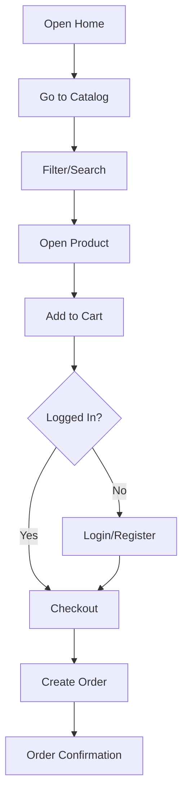
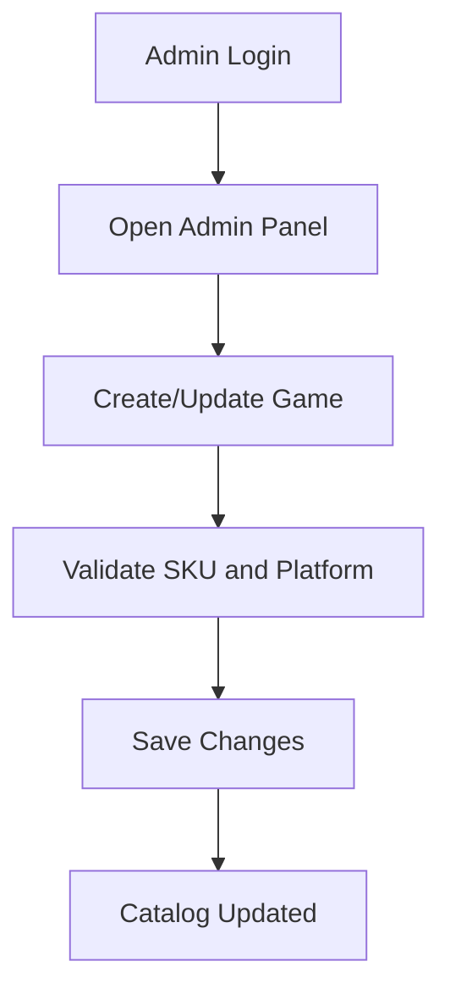

# User Flow (Key Scenarios)

## Scenario A: Browse and Buy

```mermaid
flowchart TD
    A[Open Home] --> B[Go to Catalog]
    B --> C[Filter/Search]
    C --> D[Open Product]
    D --> E[Add to Cart]
    E --> F{Logged In?}
    F -- No --> G[Login/Register]
    F -- Yes --> H[Checkout]
    G --> H
    H --> I[Create Order]
    I --> J[Order Confirmation]
```

## Scenario B: Admin Catalog Update

```mermaid
flowchart TD
    A1[Admin Login] --> B1[Open Admin Panel]
    B1 --> C1[Create/Update Game]
    C1 --> D1[Validate SKU and Platform]
    D1 --> E1[Save Changes]
    E1 --> F1[Catalog Updated]
```
